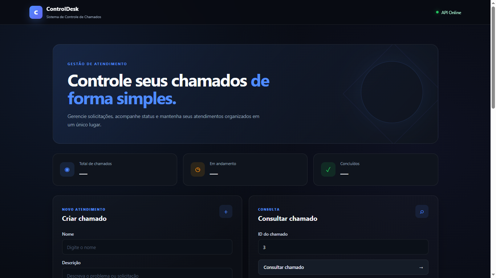

# 🎫 Sistema de Controle de Chamados

Sistema web para gerenciamento de chamados de suporte, desenvolvido com **Python, FastAPI, SQLite, HTML, CSS e JavaScript**.

O projeto foi desenvolvido como parte dos meus estudos em **desenvolvimento backend**, com foco em criação de APIs REST, banco de dados, operações CRUD, validação de dados, integração entre frontend e backend e organização de código.

## 🚀 Funcionalidades

* ✅ Criar chamados
* 📋 Listar todos os chamados
* 🔎 Consultar chamado por ID
* 🔄 Alterar status do chamado
* 🗑️ Excluir chamado
* 📊 Visualizar estatísticas dos chamados
* ❌ Retornar HTTP 404 quando o chamado não existe
* 📚 Documentação automática com Swagger/OpenAPI
* 🔗 Integração entre frontend e API REST

## 🛠️ Tecnologias

### Backend

* 🐍 Python
* ⚡ FastAPI
* 🗄️ SQLite
* 📦 Pydantic
* 🚀 Uvicorn
* 📚 Swagger / OpenAPI

### Frontend

* 🌐 HTML5
* 🎨 CSS3
* ⚡ JavaScript
* 🔗 Fetch API

## 📁 Estrutura do projeto

```text
sistema-de-controle-de-chamados/
│
├── backend/
│   ├── banco.db
│   ├── banco.py
│   ├── chamados.py
│   ├── entrada.py
│   ├── main.py
│   ├── schemas.py
│   └── services.py
│
├── frontend/
│   ├── index.html
│   │
│   ├── css/
│   │   └── style.css
│   │
│   └── js/
│       └── script.js
│
├── .gitignore
└── README.md
```

## 🧩 Organização do Backend

### `main.py`

Responsável pela criação da aplicação FastAPI e definição das rotas da API.

Também contém a configuração do CORS para permitir a comunicação entre o frontend e o backend.

### `services.py`

Contém a lógica da aplicação e faz a ligação entre as rotas da API e as operações realizadas no banco de dados.

### `banco.py`

Responsável pelas operações relacionadas ao banco de dados SQLite, como:

* criação da tabela
* inserção de dados
* consulta
* alteração
* exclusão

### `schemas.py`

Contém os modelos Pydantic utilizados para validação e estruturação dos dados recebidos e retornados pela API.

### `chamados.py`

Contém funcionalidades relacionadas ao gerenciamento dos chamados.

### `entrada.py`

Arquivo utilizado para operações de entrada relacionadas ao projeto.

## 🎨 Frontend

O frontend foi desenvolvido utilizando HTML, CSS e JavaScript.

A interface permite interagir com a API para:

* criar chamados
* listar chamados
* consultar chamados
* atualizar status
* excluir chamados
* visualizar estatísticas

O JavaScript utiliza a **Fetch API** para realizar as requisições HTTP para o backend.

## 🔄 Endpoints

| Método   | Endpoint                        | Função                            |
| -------- | ------------------------------- | --------------------------------- |
| `GET`    | `/chamados`                     | Lista todos os chamados           |
| `POST`   | `/chamados`                     | Cria um novo chamado              |
| `GET`    | `/chamados/{id_chamado}`        | Consulta um chamado               |
| `PUT`    | `/chamados/{id_chamado}/status` | Altera o status                   |
| `DELETE` | `/chamados/{id_chamado}`        | Exclui um chamado                 |
| `GET`    | `/chamados/estatisticas`        | Retorna estatísticas dos chamados |

## 📌 Status disponíveis

Os chamados podem possuir os seguintes status:

* `Aberto`
* `Em andamento`
* `Concluído`

## 📊 Estatísticas

A API possui um endpoint específico para fornecer informações sobre os chamados:

```text
GET /chamados/estatisticas
```

Ele retorna informações como:

```json
{
    "total_chamados": 10,
    "total_abertos": 4,
    "total_em_andamento": 3,
    "total_concluidos": 3
}
```

Essas informações são utilizadas pelo frontend para apresentar um resumo dos chamados no sistema.

## ▶️ Como executar

### 1. Clone o repositório

```bash
git clone URL_DO_REPOSITORIO
```

Entre na pasta do projeto:

```bash
cd sistema-de-controle-de-chamados
```

### 2. Entre na pasta do backend

```bash
cd backend
```

### 3. Instale as dependências

```bash
pip install fastapi uvicorn
```

### 4. Execute a API

```bash
python -m uvicorn main:app --reload
```

A API estará disponível em:

```text
http://127.0.0.1:8000
```

## 📚 Documentação da API

O FastAPI disponibiliza automaticamente uma documentação interativa através do Swagger.

Acesse:

```text
http://127.0.0.1:8000/docs
```

Por meio dela é possível visualizar e testar os endpoints da API diretamente pelo navegador.

## 🌐 Executando o Frontend

Com o backend em execução, abra o arquivo:

```text
frontend/index.html
```

O frontend realiza as requisições para a API através de:

```text
http://127.0.0.1:8000
```

Para desenvolvimento local, o frontend pode ser executado utilizando o **Live Server** do VS Code.

## 🎯 Objetivo do projeto

O objetivo deste projeto foi transformar os conhecimentos estudados em um projeto prático, trabalhando conceitos importantes de desenvolvimento backend e integração com frontend.

Durante o desenvolvimento foram praticados conceitos como:

* criação de APIs REST
* operações CRUD
* integração com banco de dados
* validação de dados com Pydantic
* organização de código por responsabilidades
* tratamento de erros HTTP
* utilização do CORS
* comunicação entre frontend e backend
* consumo de APIs utilizando JavaScript
* utilização do Swagger/OpenAPI
* criação de estatísticas a partir dos dados do sistema

Este projeto faz parte da minha jornada de estudos em **desenvolvimento backend com Python**, buscando transformar os conhecimentos adquiridos em aplicações práticas.
